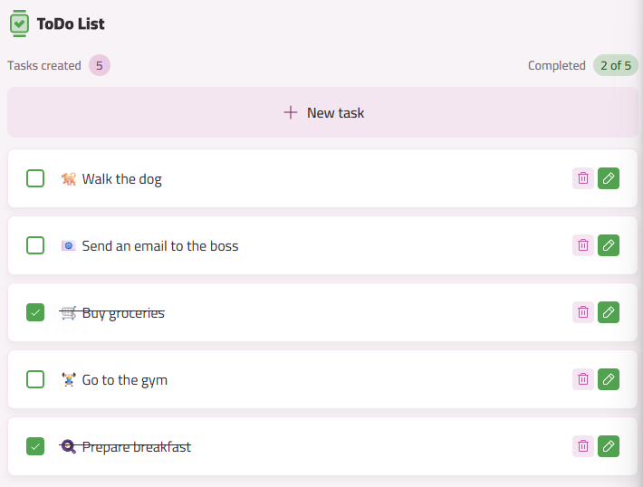

# Todo App

A modern, minimal, and beautiful Todo List application built with React, TypeScript, Vite, and TailwindCSS. This project demonstrates best practices in component-driven development, state management, and UI/UX design. Perfect for learning, inspiration, or as a foundation for your own productivity tools.

<!-- TODO: Add screenshot -->
<!--  -->

## 🚀 Features

- Add, edit, and delete tasks with a clean, intuitive interface
- Mark tasks as completed with a single click
- Inline editing for fast task updates
- Persistent storage using localStorage (your tasks are safe!)
- Responsive design, works great on desktop and mobile
- Accessible and keyboard-friendly components
- Component showcase page for design system reference

## 🛠️ Tech Stack

- **React 19** – UI library
- **TypeScript** – Type safety
- **Vite** – Lightning-fast build tool
- **TailwindCSS 4** – Utility-first CSS framework
- **React Router 7** – Routing
- **use-local-storage** – Persistent state
- **ESLint** – Code quality and linting
- **SVGR** – SVG as React components

## 📁 Project Structure

```
├── public/                # Static assets (icons, screenshot, etc.)
├── src/
│   ├── assets/            # SVGs and images
│   ├── components/        # Reusable UI components (Button, Input, Badge, etc.)
│   ├── core-components/   # App-specific core UI (TaskList, TaskItem, Header, Footer)
│   ├── hooks/             # Custom React hooks (useTasks, useTask)
│   ├── models/            # TypeScript interfaces and enums (Task model)
│   ├── pages/             # Page-level components (Home, Components showcase)
│   ├── index.css          # TailwindCSS and global styles
│   ├── main.tsx           # App entry point
│   └── App.tsx            # Main app component
├── package.json           # Project metadata and scripts
├── vite.config.ts         # Vite configuration
├── tsconfig*.json         # TypeScript configuration
└── README.md              # This file
```

## 🧩 Component-Driven Architecture

- **Reusable Components:** All UI elements (buttons, inputs, badges, cards) are built as isolated, reusable components.
- **Core Components:** Task management logic is encapsulated in core components for clarity and maintainability.
- **Custom Hooks:** State and logic (like task CRUD and persistence) are abstracted into custom hooks for reusability.
- **Type Safety:** All data models and props are strictly typed with TypeScript.

## ⚙️ Getting Started

1. **Clone the repository:**
   ```bash
   git clone https://github.com/your-username/todo-app.git
   cd todo-app
   ```
2. **Install dependencies:**
   ```bash
   pnpm install # or npm install or yarn
   ```
3. **Run the development server:**
   ```bash
   pnpm dev
   ```
4. **Open in your browser:**
   Visit [http://localhost:5173](http://localhost:5173)

## 📦 Build for Production

```bash
pnpm build
```

The output will be in the `dist/` folder.

## 📝 Technical Details

- **Task Model:**
  ```ts
  export interface Task {
    id: string;
    title: string;
    concluded?: boolean;
    state?: TaskState;
  }
  ```
- **Persistence:** All tasks are stored in `localStorage` under the key `tasks`.
- **Styling:** TailwindCSS utility classes are used throughout for rapid, consistent styling.
- **SVG Icons:** Imported as React components for flexibility and performance.
- **Linting:** ESLint with recommended and type-aware rules ensures code quality.

## ✨ Contributing

This is a project used to review some techniques and test new packages, but if anyone wants to contribute, feel free to do so.

## 📄 License

[MIT](LICENSE)

---

> Made with ❤️ by Alison Bessa
